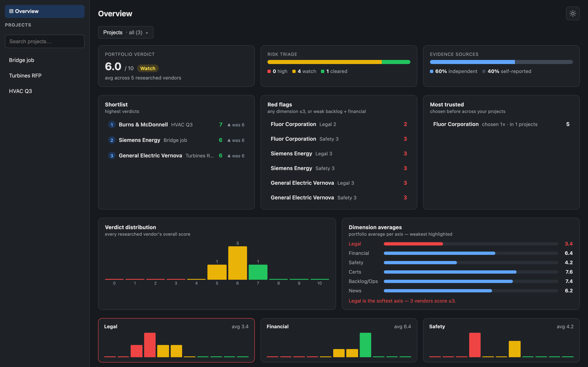
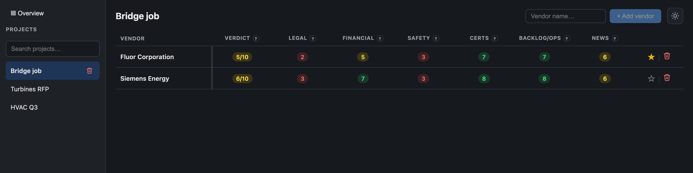
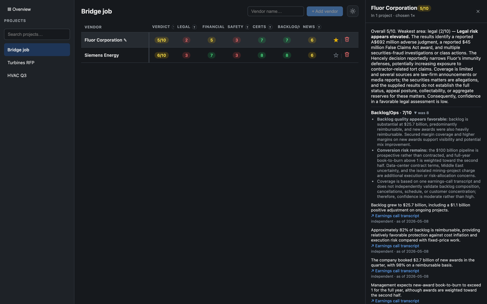
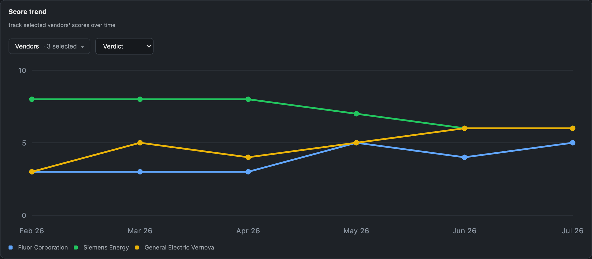

# Vendor Due-Diligence Agent

Give it a vendor name, get back a structured, **cited** risk profile a procurement team could
actually file: company snapshot, financial signals, legal & regulatory exposure, safety
record, certifications, delivery/backlog health, recent news, and an overall verdict. Every
finding carries a source URL, a source *type* (independent vs. the vendor's own material), and
an "as of" date. Reports stream in dimension-by-dimension, and every score is remembered over
time so you can watch a vendor's risk trend.

Built on [Tavily](https://tavily.com) for retrieval and OpenAI's Responses API for structured
synthesis.

---

## The problem

Evaluating a vendor for a contract means answering: *are they solvent, are they in legal
trouble, do they have a safety record, can they actually deliver, and can I trust where that
answer came from?* Today that's hours of manual searching, and the output is a pile of tabs and
a gut feel, nothing you can file, audit, or compare across the five vendors bidding on the same
RFP.

The take-home's starter agent shows the raw capability (one Tavily search, summarized by an LLM
into prose), but it stops exactly where the *value* starts. There are no citations to check, no
sense of whether a claim came from a court record or the vendor's own marketing page, no memory,
and no way to compare vendor A against vendor B. It's a demo, not a tool a procurement team can
make a decision on.

## The big picture

This turns that one-shot search into a **decision-grade workflow**. A vendor name goes through
entity resolution, then six risk dimensions are retrieved *in parallel* from Tavily, each as
several focused queries, tuned per dimension, and synthesized by the LLM into scored, cited
sections under a schema (no free-text parsing). Results stream to the UI as each dimension lands,
every section is cached by resolved domain, and every score is appended to a history table that
powers a trend chart. Vendors live in projects, so N reports become a portfolio you can triage.

```
vendor name
    │
    ▼
┌─────────────────┐   entity resolution: resolve the messy input ("Voith Hydro") to a
│  Snapshot       │   canonical company + domain, so every downstream query and cache
│  (entity card)  │   key is stable across renames and spelling variants.
└────────┬────────┘
         │  domain (vendor_key)
         ▼
┌──────────────────────────────────────────────┐   6 scored dimensions, retrieved in
│  legal · safety · financial · certifications  │   parallel. Each = several focused
│  backlog · news        (parallel retrieval)   │   Tavily queries → pooled + deduped.
└────────┬─────────────────────────────────────┘
         │  raw results per dimension
         ▼
┌─────────────────┐   OpenAI Responses API (structured output): each dimension → a Section
│  Synthesis      │   of {claim, citation(url, source_type, as_of)} findings + a 0–10 score
│  (per section)  │   + reasoning. The schema is enforced; nothing is regex-scraped.
└────────┬────────┘
         │  scored, cited sections
         ▼
┌─────────────────┐   overall verdict + reasoning. Each section is cached (per-domain,
│  Verdict        │   TTL per dimension) and every score is appended to history for trends.
└─────────────────┘
         │
         ▼  streamed to the UI over SSE as each dimension completes
```

## Walkthrough

**1 · Portfolio overview.** The Overview aggregates every vendor across projects into a decision
surface: a portfolio verdict, a risk triage bar, the share of evidence that's independent vs.
self-reported, a shortlist and red-flag list (each row clicks through to the vendor), and
score distributions per dimension.

<picture>
  <source media="(prefers-color-scheme: dark)"  srcset="docs/assets/01-overview-dark.png">
  <source media="(prefers-color-scheme: light)" srcset="docs/assets/01-overview-light.png">
  
</picture>

**2 · Compare vendors side by side.** Inside a project, vendors sit in one table (verdict plus
every risk dimension, color-coded), and fill in live over SSE as each dimension's research
completes. Star the ones you're shortlisting.

<picture>
  <source media="(prefers-color-scheme: dark)"  srcset="docs/assets/03-comparison-dark.png">
  <source media="(prefers-color-scheme: light)" srcset="docs/assets/03-comparison-light.png">
  
</picture>

**3 · Open a cited report.** Every score is backed by findings, and every finding carries its
source link, whether that source is **independent or self-reported**, and an **as-of date**. The
verdict explains itself ("Weakest area: legal (2/10)…"), and dimensions show how the score moved
since last time. This is the difference between "the vendor looks risky" and something a reviewer
can audit.

<picture>
  <source media="(prefers-color-scheme: dark)"  srcset="docs/assets/04-report-dark.png">
  <source media="(prefers-color-scheme: light)" srcset="docs/assets/04-report-light.png">
  
</picture>

**4 · Track risk over time.** Scores are institutional memory: append-only, keyed by domain, so
they survive re-runs, renames, and even deleting the vendor. Pick vendors and a dimension to see
the trend.

<picture>
  <source media="(prefers-color-scheme: dark)"  srcset="docs/assets/02-trend-dark.png">
  <source media="(prefers-color-scheme: light)" srcset="docs/assets/02-trend-light.png">
  
</picture>

## Why Tavily is the core of the solution

Retrieval *is* the product here (the LLM only gets to be as good as what Tavily brings back), so
this is where most of the design went (`engine/config.py`):

- **Several focused queries per dimension, not one.** `legal` runs `"{name} lawsuit"`,
  `"{name} litigation"`, `"{name} regulatory fine"`, `"{name} investigation"` as separate Tavily
  searches, then pools and dedupes. Each single-concept query gets clean relevance instead of one
  keyword-stuffed query fighting itself.
- **Per-dimension parameter tuning.** `topic` (`general`/`news`/`finance`), `search_depth`,
  `max_results`, an optional recency window, and Tavily's `country` param are set per dimension,
  because "recent legal filings" and "latest audited financials" want different retrieval.
- **Source independence is enforced, and made visible.** Independent dimensions (legal, safety)
  pass `exclude_domains=[vendor domain]` so the vendor can't be the source of its own clean bill
  of health. Financials deliberately *don't* (audited figures are self-reported by nature), and
  every finding is tagged `independent` vs `self_reported` so the distinction shows up in the UI
  (that "60% independent" stat on the dashboard is exactly this).
- **Search on the press name, not the legal name.** Entity resolution picks the name articles
  actually use ("GE Vernova", not "GE Vernova LLC"), which materially changes recall.
- **A retrieval lesson worth calling out.** Tavily's `start_date` silently drops any result it
  can't date: for some vendors that's *every* result, yielding zero news. So dimensions where
  freshness is a bonus (news, financials) use no hard window and instead carry per-finding
  `as_of` dates. You only learn this by running retrieval against obscure private vendors, not
  just big public ones, which is the whole point of doing the work.

Results are cached per (domain, dimension) with a per-dimension TTL, so re-opening a report is
instant and doesn't re-spend Tavily/LLM credits.

## How it works under the hood

```
backend/
  src/vendor_dd/
    db.py            shared SQLite connection setup (WAL, logged exec) for the stores below
    engine/          surface-agnostic core (no web framework in here)
      config.py      per-dimension retrieval tuning
      tavily_client  Tavily search wrapper + params
      retrieval.py   multi-query pooling + dedup
      llm.py         OpenAI Responses API, structured outputs
      synthesis.py   results → scored, cited Section
      pipeline.py    orchestration; emits events (snapshot → sections → verdict)
      cache.py       per-(domain, dimension) TTL cache
      history.py     append-only score history (powers the trend chart)
      schemas.py     Dimension / Section / Citation / EntityCard / Report
    surfaces/        thin adapters over the engine
      cli.py         one-shot terminal report
      api/           FastAPI: projects/vendors CRUD, SSE streaming, dashboard + trend
  tests/             186 tests
frontend/            React + Vite + TS: projects, live comparison table, report panel,
  src/               portfolio dashboard, score-trend chart (114 tests)
evals/ground_truth/  fixtures for a planned citation-support eval
```

Decisions worth knowing:

- **The engine knows nothing about HTTP.** The CLI and the API are both thin adapters over the
  same `iter_events` pipeline. Adding an MCP surface later is another adapter, not a rewrite.
- **SSE with a single-flight run registry.** Two tabs streaming the same vendor subscribe to one
  generation (history replayed, then live events) instead of double-spending on Tavily/LLM.
  Generation runs in a background thread and drains to the cache even if the client disconnects.
- **SQLite for cache, project store, and score history**, sharing one file behind a small
  `SqliteConn` base. Writes to the project store are serialized with a lock because one connection
  is shared across the threadpool and the background worker.

## Observability

The assignment flags tracing/observability as a bonus; here it's first-class and
industry-standard in shape (structured logs + correlation), without pulling in a vendor SDK:

- **Five JSON-line channels** (`general`, `llm`, `tavily`, `http`, `db`): one structured event
  per line (`ts, level, logger, correlation_id, event, payload`), in rotating files.
- **Correlation IDs** are minted per CLI run and per HTTP request and propagated via `contextvars`,
  including *into the background report thread* (`copy_context`), so a whole report generation is
  greppable by one ID across search, LLM, and DB calls.
- **Secret redaction** in the formatter: `TAVILY_API_KEY` / `OPENAI_API_KEY` values are scrubbed
  from any logged payload.

For this scale, structured JSON logging was the right call: greppable, zero-dependency, and enough
to debug any single report end to end. It can be upgraded to LangSmith or OpenTelemetry if richer
tracing is needed; the correlation-ID and structured-event backbone is already the shape a span
exporter would sit on, so it becomes per-run / per-dimension spans without reworking the call sites.

## Some cool technical stuff

A few things under the hood that were satisfying to get right:

- **Single-flight streaming.** Open the same vendor in two tabs and you don't pay twice: the
  second stream subscribes to the one in-flight generation (cached history replayed, then live
  events). Generation runs on a background thread that drains to the cache even if every client
  disconnects, and the request's correlation id rides into that thread via
  `contextvars.copy_context`, so one id greps the whole run.
- **Everything is keyed by resolved domain, not the typed name.** Entity resolution maps "Voith"
  and "Voith Hydro" to one domain, so they share one set of lookups, a rename never loses
  research, and the same vendor added to three projects is researched once. Deletes use
  refcounted eviction: a vendor's cached research is dropped only if no other vendor (in any
  project) still points at that domain.
- **Append-only institutional memory.** Every score ever assigned is kept, keyed by domain,
  surviving deletion, rename, and re-runs. That table powers the trend chart, bucketed to one
  point per month by a pure function.
- **Retrieval is engineered per dimension.** Each risk area runs several focused Tavily queries
  (pooled and deduped) with its own topic/depth/recency tuning, and independent dimensions
  exclude the vendor's own domain so it can't vouch for itself.
- **Graceful stream-drop recovery.** If the live SSE connection drops mid-report, the UI falls
  back to polling the report endpoint instead of failing the row. Generation runs to completion
  on the server regardless of who is listening, so even a closed tab ends up with a finished,
  cached report.
- **Resume a half-finished report.** If a report fails partway (a flaky dimension, a dropped
  run), the row offers a retry that re-streams only what is missing: every section that already
  completed is served from cache, so you never re-pay for the work that succeeded.
- **Rename-during-generation is safe.** The entity snapshot is keyed by resolved domain and the
  `vendor_key` is backfilled mid-run, so renaming a vendor (or deleting and re-adding it) while
  its report is still streaming never orphans or corrupts the research in flight.

## Run it

**Prereqs:** Python ≥3.11, Node ≥18, and API keys for Tavily and OpenAI.
[`uv`](https://docs.astral.sh/uv/) is optional but supported.

### 1 · Keys (from the repo root)

```bash
cp .env.example .env
# then edit .env and set TAVILY_API_KEY and OPENAI_API_KEY. BOTH are required.
# Without them the CLI/API exits with "Set TAVILY_API_KEY and OPENAI_API_KEY in .env".
```

### 2 · Install the backend (`vendor-dd` package)

```bash
cd backend
python -m venv .venv && source .venv/bin/activate   # Windows: .venv\Scripts\activate
pip install -e .                                     # installs deps + two console commands
```

<sub>Prefer <code>uv</code>? Instead of the two lines above: <code>uv venv && source .venv/bin/activate && uv pip install -e .</code>, or skip installing entirely and prefix any command below with <code>uv run</code>.</sub>

### 3 · See a report (CLI, the fastest path)

```bash
vendor-dd "GE Vernova"
```

### 4 · Full app (API + web UI), two terminals

```bash
# terminal 1: API on :8000  (from backend/, with the venv activated)
vendor-dd-api

# terminal 2: UI on :5173
cd frontend && cp .env.example .env && npm install && npm run dev
```

Open http://localhost:5173, create a project, add vendors, and watch reports stream in.

## Testing

```bash
cd backend && uv run pytest        # 186 tests
cd frontend && npm test            # 114 tests (vitest)
```

The engine is built from **pure functions** (retrieval pooling, synthesis, verdict assembly,
dashboard aggregation, monthly bucketing) that take data and return data, so the bulk of the suite
runs with no network and no mocks-of-mocks. LLM and Tavily sit behind small `Protocol` interfaces
with fakes. Development was test-first throughout.

## Design decisions & tradeoffs

- **Scores from findings, not free text.** The LLM emits a schema (findings + citations + score),
  enforced by the Responses API `parse`, no regex-scraping model prose. Costs some prompt
  engineering; buys auditability and stable parsing.
- **Cache/history keyed by resolved domain, not the typed name.** "Voith" and "Voith Hydro"
  resolve to one domain and share research; a rename keeps its history. Entity resolution is the
  price of that.
- **No vector DB.** Retrieval is Tavily-native and per-dimension; findings are small and
  structured. A vector store would be complexity without a job here (YAGNI).
- **SQLite over Postgres.** Single-file, zero-ops, right for a take-home and a single node. The
  `SqliteConn` seam makes swapping it out mechanical if scale ever demanded it.

## What's next

The natural next step is talking to the data. Every report already caches structured, cited
findings per vendor; layering RAG over that store lets a user ask questions across the whole
portfolio in natural language ("which of these vendors has open litigation?", "who scores worst
on safety, and why?") and get answers grounded in the sources already gathered, with citations
intact.

## How this was built

The process, in one line: **took a use case → mapped a solution → translated it into code →
had AI write it.**

- **Use case.** Start from a real workflow (a procurement team vetting vendors for an RFP)
  and the concrete question it has to answer with evidence.
- **Solution.** Map that to a design: entity resolution, per-dimension retrieval, cited and
  typed findings, streaming, a comparison/portfolio surface. The design docs and specs live
  under `docs/superpowers/`.
- **Code.** Translate the design into a task-by-task plan with explicit interfaces and tests.
- **AI wrote it.** A coding agent (Claude Code) implemented each task test-first (spec → plan →
  red/green/refactor), under direction and review. Every claim in these docs was verified
  against the running code; the point is to show *direction* of AI tools, not unverified output.
